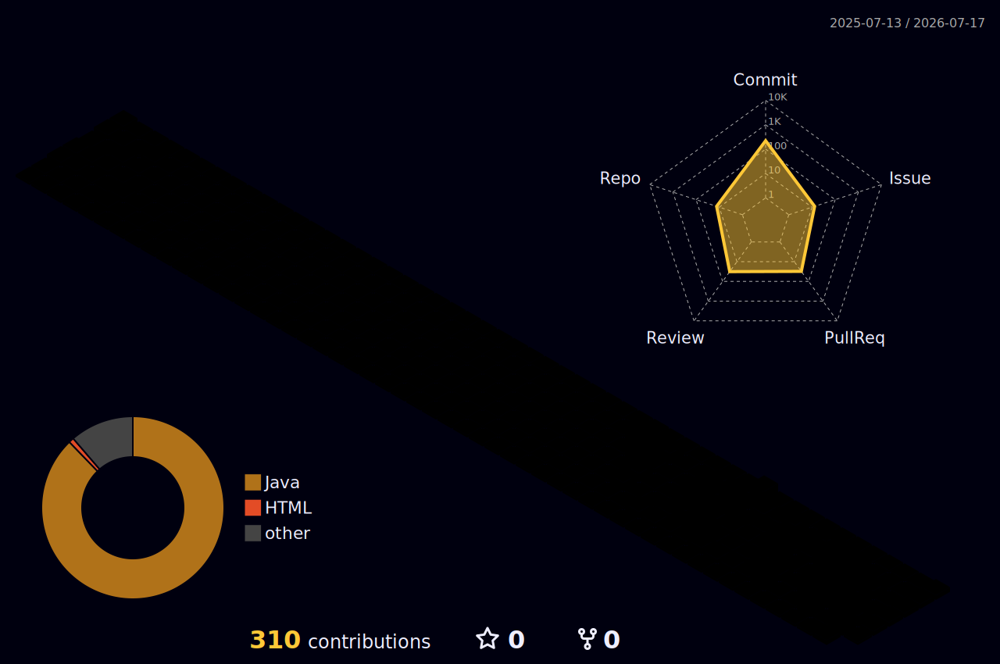

<div align="center">


<br/>


<br/>
<br/>

<a href="https://github.com/IMSUN9">
  
</a>
<a href="https://velog.io/@loaded_diaper/posts">
  
</a>
<a href="mailto:sungu4790@naver.com">
  
</a>

<br/>
<br/>


</div>

---

<br/>

<h2 align="center">About Me</h2>

<div align="center">

<table>
  <tr>
    <td align="center" width="33%">
      <h3>Build</h3>
      <p>직접 만들며 배웁니다.</p>
    </td>
    <td align="center" width="33%">
      <h3>Understand</h3>
      <p>왜 동작하는지 끝까지 파고듭니다.</p>
    </td>
    <td align="center" width="33%">
      <h3>Finish</h3>
      <p>작은 기능도 끝까지 완성합니다.</p>
    </td>
  </tr>
</table>

</div>

<br/>

```text
주문, 결제, 재고, 인증처럼 데이터 정합성이 중요한 백엔드 흐름을 직접 구현하며 성장하고 있습니다.
단순히 기능을 따라 만드는 것보다, 구조와 흐름을 이해하고 끝까지 완성하는 과정을 중요하게 생각합니다.
```

---

<br/>

<h2 align="center">Tech Stack</h2>

<div align="center">


<br/>
<br/>


</div>

---

<br/>

<h2 align="center">Pinned Backend Projects</h2>

<table>
  <tr>
    <td width="50%" valign="top">
      <h3 align="center">Coffee Order</h3>
      <p align="center">
        <b>Kafka Outbox 기반 커피 주문 · 포인트 결제 시스템</b>
      </p>
      <p>
        포인트 충전, 커피 주문, 인기 메뉴 조회, Kafka + Outbox 기반 주문 데이터 전송을 구현한 백엔드 프로젝트입니다.
      </p>
      <ul>
        <li>Controller → Facade → Service 구조 적용</li>
        <li>PESSIMISTIC_WRITE 기반 포인트 동시성 제어</li>
        <li>Kafka + Outbox 패턴으로 주문 완료 이벤트 발행</li>
        <li>Consumer 기반 Mock 데이터 플랫폼 전송</li>
        <li>동시 주문 테스트로 잔액 초과 차감 방지 검증</li>
      </ul>
      <p align="center">
        
        
        
        
        
      </p>
      <p align="center">
        <a href="https://github.com/IMSUN9/coffee-order">
          
        </a>
      </p>
    </td>
    <td width="50%" valign="top">
      <h3 align="center">Flash Sale Commerce</h3>
      <p align="center">
        <b>실시간 특가 커머스 · 재고/결제/환불 정합성</b>
      </p>
      <p>
        한정 수량 특가 상품의 선착순 구매, 결제, 환불, 품절, 재고 이력 관리를 다룬 팀 프로젝트입니다.
      </p>
      <ul>
        <li>선착순 이벤트 구매 흐름 설계</li>
        <li>Redis Lock 기반 재고 동시성 제어</li>
        <li>결제 실패 / 환불 시 재고 복구</li>
        <li>품절 처리 및 재고 변경 이력 관리</li>
        <li>PortOne 결제 승인 흐름 연동</li>
      </ul>
      <p align="center">
        
        
        
        
      </p>
      <p align="center">
        <a href="https://github.com/inan0226/team8-sale-commerce">
          
        </a>
      </p>
    </td>
  </tr>

  <tr>
    <td width="50%" valign="top">
      <h3 align="center">Sparta Payment System Starter</h3>
      <p align="center">
        <b>Spring 결제 시스템 학습 Starter 프로젝트</b>
      </p>
      <p>
        커머스 결제 시스템 구조를 학습하기 위한 Starter 프로젝트입니다. 결제 흐름, 주문 흐름, 도메인 분리 구조를 익히는 기반 프로젝트입니다.
      </p>
      <ul>
        <li>Spring Boot 기반 결제 시스템 구조 학습</li>
        <li>주문/결제 도메인 흐름 이해</li>
        <li>JPA 기반 데이터 저장 흐름 학습</li>
        <li>커머스 백엔드 구조 실습</li>
      </ul>
      <p align="center">
        
        
      </p>
      <p align="center">
        <a href="https://github.com/IMSUN9/sparta-payment-system-starter">
          
        </a>
      </p>
    </td>
    <td width="50%" valign="top">
      <h3 align="center">Payment System Project</h3>
      <p align="center">
        <b>팀 프로젝트 · 스파르타 스프링 발전 결제 시스템</b>
      </p>
      <p>
        결제 시스템 흐름을 팀 단위로 구현하며 주문, 결제, 포인트, 환불과 같은 커머스 핵심 도메인을 다룬 프로젝트입니다.
      </p>
      <ul>
        <li>커머스 결제 흐름 구현</li>
        <li>포인트 및 환불 도메인 설계</li>
        <li>주문 상태와 결제 상태 흐름 관리</li>
        <li>팀 컨벤션 기반 협업 경험</li>
      </ul>
      <p align="center">
        
        
        
      </p>
      <p align="center">
        <a href="https://github.com/kolyn092/payment-system-project">
          
        </a>
      </p>
    </td>
  </tr>

  <tr>
    <td width="50%" valign="top">
      <h3 align="center">Spring BackOffice</h3>
      <p align="center">
        <b>E-Commerce BackOffice Management System</b>
      </p>
      <p>
        이커머스 운영 관리를 위한 BackOffice 시스템입니다. 주문, 상품, 관리 기능을 중심으로 백오피스 도메인 흐름을 경험한 팀 프로젝트입니다.
      </p>
      <ul>
        <li>이커머스 백오피스 구조 경험</li>
        <li>주문 도메인 흐름 구현</li>
        <li>상태 전이와 검증 로직 처리</li>
        <li>팀 프로젝트 협업 및 코드 리뷰 경험</li>
      </ul>
      <p align="center">
        
        
        
      </p>
      <p align="center">
        <a href="https://github.com/silverThunder09/spring-backoffice">
          
        </a>
      </p>
    </td>
    <td width="50%" valign="top">
      <h3 align="center">KBU</h3>
      <p align="center">
        <b>School Project</b>
      </p>
      <p>
        학습 과정에서 진행한 Java 기반 프로젝트입니다. 기본 문법, 객체지향 구조, 프로젝트 단위 구현 경험을 쌓은 저장소입니다.
      </p>
      <ul>
        <li>Java 기반 프로젝트 구현</li>
        <li>객체지향 프로그래밍 학습</li>
        <li>기능 단위 코드 작성 경험</li>
        <li>기초 개발 흐름 정리</li>
      </ul>
      <p align="center">
        
        
      </p>
      <p align="center">
        <a href="https://github.com/IMSUN9/KBU">
          
        </a>
      </p>
    </td>
  </tr>
</table>

---

<br/>

<h2 align="center">Engineering Focus</h2>

<table>
  <tr>
    <td align="center" width="25%">
      <h3>Transaction</h3>
      <p>주문, 결제, 포인트 차감 흐름에서 데이터 정합성을 지키는 트랜잭션 설계를 고민합니다.</p>
    </td>
    <td align="center" width="25%">
      <h3>Concurrency</h3>
      <p>비관적 락과 Redis Lock을 활용해 동시에 요청이 들어오는 상황을 안전하게 처리합니다.</p>
    </td>
    <td align="center" width="25%">
      <h3>Architecture</h3>
      <p>Controller → Facade → Service → Repository 구조로 도메인 흐름을 명확히 분리합니다.</p>
    </td>
    <td align="center" width="25%">
      <h3>Event Driven</h3>
      <p>Kafka와 Outbox 패턴을 활용해 주문 완료 이벤트를 안정적으로 전송하는 구조를 구현합니다.</p>
    </td>
  </tr>
</table>

---

<br/>

<h2 align="center">AI-Assisted Development</h2>

<div align="center">

<table>
  <tr>
    <td align="center" width="25%">
      <h3>Design</h3>
      <p>AI를 활용해 기능 흐름, 도메인 분리, 트랜잭션 경계를 먼저 검토합니다.</p>
    </td>
    <td align="center" width="25%">
      <h3>Debugging</h3>
      <p>에러 로그와 테스트 실패 원인을 분석하고, 문제를 단계별로 좁혀갑니다.</p>
    </td>
    <td align="center" width="25%">
      <h3>Code Review</h3>
      <p>구현 후 구조, 책임 분리, 예외 처리, DB 리소스 사용 관점에서 코드를 점검합니다.</p>
    </td>
    <td align="center" width="25%">
      <h3>Documentation</h3>
      <p>README, API 명세, 트러블슈팅 기록을 정리하며 학습 내용을 문서화합니다.</p>
    </td>
  </tr>
</table>

<br/>


</div>

```text
AI를 단순 코드 생성 도구로만 사용하지 않고,
설계 방향 검토, 에러 분석, 테스트 전략 수립, 문서화에 함께 활용하며 개발 흐름을 개선하고 있습니다.
```

---

<br/>

<h2 align="center">Contribution Garden</h2>

<div align="center">


<br/>
<br/>


<br/>
<br/>



</div>
---

<br/>

<h2 align="center">GitHub Dashboard</h2>

<div align="center">


<br/>
<br/>


<br/>
<br/>


</div>

---

<br/>

<h2 align="center">Contact</h2>

<div align="center">

<a href="mailto:sungu4790@naver.com">
  
</a>
<a href="https://velog.io/@loaded_diaper/posts">
  
</a>
<a href="https://github.com/IMSUN9">
  
</a>

</div>

---

<br/>

<div align="center">

<h2>Motto</h2>

<h1>끝까지 가면 내가 다 이겨.</h1>

<br/>


</div>
